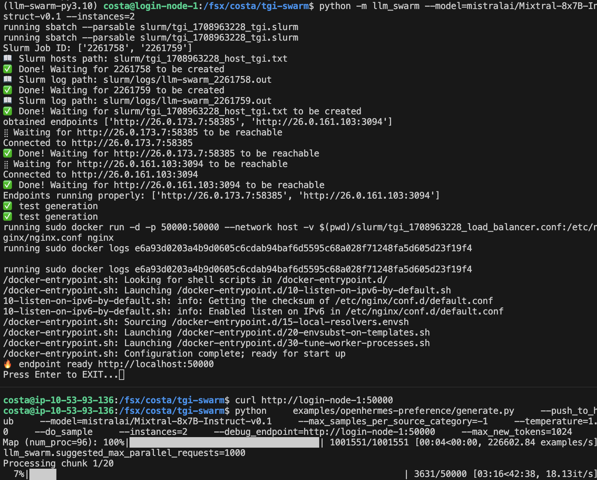

# Open Hermes Preference Dataset Generation

This directory contains scripts to generate the https://huggingface.co/datasets/argilla/OpenHermesPreferences dataset.


## Get started

You can run the following to do some quick tests. By default it generates 2 samples per source category and pushes the dataset to the hub, which is about ~100 samples, which looks like https://huggingface.co/datasets/vwxyzjn/openhermes-dev__mistralai_Mistral-7B-Instruct-v0.1__1707504194. 

```bash
poetry run python examples/openhermes-preference/generate.py  --push_to_hub --model=mistralai/Mixtral-8x7B-Instruct-v0.1 --max_samples_per_source_category=2 --temperature=1.0 --do_sample
```

To perform the full generation, you can run the following command 

```
python \
    examples/openhermes-preference/generate.py \
    --push_to_hub \
    --model=mistralai/Mixtral-8x7B-Instruct-v0.1 \
    --max_samples_per_source_category=-1 \
    --temperature=1.0 \
    --do_sample \
    --instances=2 \
    --max_new_tokens=1024 > output.txt 2> output_error.txt
```

We split the generations by default to 20 chunks, and each chunk took about 40 mins to generate on a 8xH100 machine, the total generation time is about 13~16 hours. The generation speed also scales with the number of instances, so you can use your hardwares with great flexibility.




You can then perform similar procedure with models like `NousResearch/Nous-Hermes-2-Yi-34B`.


## Preference Dataset PairRM Creation

We use the [PairRM](https://huggingface.co/llm-blender/PairRM) model to score pairs of chosen/rejected completions and then switch the preference dataset to those preferred by PairRM.

### Prerequisites

```bash
pip install -r requirements.txt
```

### Usage

To process the preference data for a single shard, run the following command where you can specify the number of shards and the index of the shard to process.

```bash
python dpo_pair_rm.py --num_shards 20 --shard_index 0
```

To run the PairRM model on all the data shards, one can call the `dpo_pair_rm.py` script in parallel for each shard index.


After all the shard indices for the train/test splits have been processed, the preference dataset shards can be concatenated and the final dataset can be pushed to the hub via:

```bash
python concat_and_push.py --num_shards 20
```
